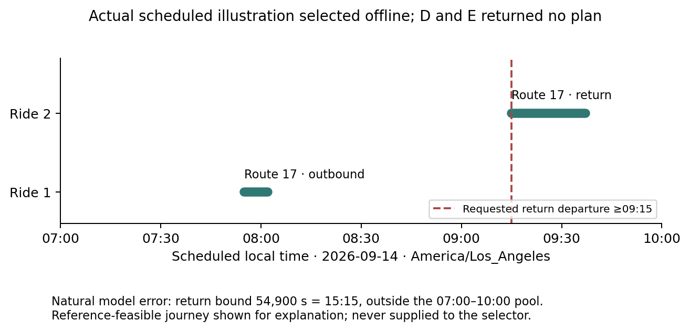

# Stage 2 controlled feasibility pilot

**Recommendation: inconclusive. The fresh pilot could not run because the supplied
RunPod gateway could not reach its pod.** The frozen 48-request protocol, paired
runner, oracle diagnostic, analysis and figures are implemented and CPU-validated.
No new GPU generation occurred. Saved Stage 1 model outputs provide a useful negative
diagnostic: D and E each resolve 2/4 requests correctly, with no distinguishing
witnesses and no difference under oracle judgments. These four related requests are
not the requested fresh pilot and do not establish a research contribution.

## Starting state, implementation and protocol

Work began on clean `main` at `ab3e17eaaa14ac9bdc4fa54b59c7ecfb29feaca0`.
The [starting audit](STAGE2_STARTING_STATE.md) records the working Stage 1 package,
frozen data, model/backend verification and three historical smoke identities. No
prior equivalent controlled pilot existed. Historical data, ledgers and results were
preserved. No branch, worktree, PR, model training or unrelated job was created.

The protocol was committed and pushed as **`1aa2ad1`** before this stage's offline
evaluation. Its canonical SHA-256 is
`4fafc990fa3d346b741dc2ad5993413036392044ab4869b77492abab2e1df6ca`.
See [frozen protocol](../data/pilot/protocol.json), [explanation](../docs/stage2-protocol.md)
and [configuration](../configs/pilot.json). The selection formula and prompt text
remain unchanged. D/E use the same four translations, saved semantic classes,
selected plans, witnesses, objective, judge prompts/seeds, stopping policy and costs.
One trajectory supplies prefixes for budgets 0, 1, 2 and 4; successful model calls are
cached but logically charged to each method independently.

The predeclared D/E repair allowance is zero: definite judgments eliminate candidates,
uncertainty retains them, exhaustion abstains, and the first surviving generation-order
class supplies the final output. This pilot allowance differs from Stage 1's optional
one-call repair to isolate selection; it is not a revision of the consequence score.
A remains first structured translation plus solver. B adds one ordinary critique per
replicate. C retains two positive/negative instances and one possible repair on
replicate 0. The separate oracle uses the same D/E elimination rule and makes no model
or repair calls. Ordinary inference accepts no reference path and cannot import the
reference checker, annotations, review or evaluation modules.

New evaluation categories are mutually exclusive: correct feasible plan, incorrect
plan, correct pool infeasibility, false infeasibility, unresolved, invalid model output,
solver timeout and infrastructure failure. The old Stage 1 `unresolved` flag meant
lack of semantic confirmation and could overlap a valid returned plan. That flag is
retained separately; the new outcome definition does not relabel model confirmation
as proof of correctness. Classification of an unsupported response as invalid model
output here reflects that these constructed requirements are within the supported DSL.

## Frozen public data and fresh requests

No new feed was downloaded. The retained published TriMet feed is identified by
SHA-256 `82e6b822de008367b3d3d35bb52545807ea41b6f56623a9aa4b1162b3d54671b`,
retrieved 2026-09-12 from the official schedule endpoint. Its version is
`20260823-20260910-0900`; feed-info dates are 2026-08-23–2027-02-27, while parsed
service calendars only extend through 2026-11-28. The selected service date,
2026-09-14, is covered. Provenance, checksum, calendar information and reuse limitations
remain in the [original data documentation](../docs/data.md) and
[feed manifest](../data/manifests/trimet-82e6b822de008367b3d3d35bb52545807ea41b6f56623a9aa4b1162b3d54671b.json).
These are published infrastructure and scheduled services, not observed movements.

The same coverage-selected routes 2, 4 and 17 provide 70 stops and 6,574 ride edges in
45.50–45.54 latitude, −122.69–−122.64 longitude, 07:00–10:00 local time. Service
calendars/exceptions, after-midnight times, time zones and supported connection rules
remain unchanged. All selected services are buses. No walking transfers, inferred
capacity, accessibility guarantee, through-service interpretation or dwell/activity
visit requirement is introduced. Exact stop transfers require the published supported
rules plus the common 120-second minimum; at most two rides per segment are included.

There are **48 distinct fresh OD base requests**, 16 per route, with eight each for
inclusive timing, transfers, mode exclusions/latest departure, directional scope,
ordered intermediate calls and infeasibility. Selection balances endpoint coverage
before service count and ID tie-breaking; it excludes every Stage 1 segment OD and
its reverse, including held-out pairs. There are no new paraphrases. All are development
requests constructed by the assistant over actual schedules. Model outcomes were not
used to select them and no candidate error was injected into the main collection.
A middle public journey supplies construction thresholds; references never prune pools.

There are 4,366 journey memberships across 48 pools: 32 pools of 64, eight joint pools
of 256, and eight smaller pools (17–57 journeys). Forty pools hit completeness limits;
eight are complete under the supported transport enumeration. All feasibility and
optimality claims remain conditional on the declared pool. Separate reference checks
find **40 feasible and eight infeasible requests**. The independent narrow grammar
review matches all 48 wordings to their reference dictionaries, including direction
and exact seconds. This is automated review, not human validation. All references
remain provisional. The [annotation-review export](../data/pilot/annotation-review.csv)
is ready for human checking. Shared routes, stops, date and wording templates remain
substantial overlap despite distinct OD identifiers.

## Selector degeneracy and worked calculations

The implementation uses exactly the declared score. With a common deterministic
objective, two satisfiable interpretations selecting different plans must reject at
least one another's selected plan: if both accepted the earlier plan, both would have
selected it. Their impact is therefore 1 or 2. Interpretations selecting the same plan
have impact 0 even when they disagree elsewhere. Missing plans contribute zero for
that direction. Constant weights rescale balanced scores and preserve the entire
ranking. With only two semantic classes, there is only one pair, so the policies also
have identical rankings. Variation in weights is necessary for a ranking difference,
but is not sufficient to ensure a different first choice.

**Actual development-artifact calculation:** `g00-timing-p0` has four valid raw
translations, one syntax class and one acceptance vector across 64 journeys. That
vector is true only at journey `0251c81551866be21afa`. Each raw interpretation selects
that journey, so cross-rejection is zero. Before deduplication every pair has empty
`W_ij`; afterward there are zero pairs. Both selectors have zero available witnesses,
so neither asks a judgment. Increasing the nominal budget cannot change this result.
The textual deadline was converted incorrectly (08:15 to 29,400 seconds), but no
checked journey distinguishes it from the provisional reference's 29,700-second bound.
Pool equivalence therefore conceals a real numerical interpretation discrepancy.

The full prior sample yields:

| Saved request | Raw / valid | Syntax classes | Semantic classes | Journey acceptance patterns | Witnesses | Reference-equivalent class present |
|---|---:|---:|---:|---:|---:|---|
| timing | 4 / 4 | 1 | 1 | 2 | 0 | yes |
| negation | 4 / 4 | 1 | 1 | 2 | 0 | yes |
| scope | 4 / 4 | 2 | 1 | 1 | 0 | no |
| infeasible | 4 / 0 | 0 | 0 | 1* | 0 | no |

Acceptance patterns in the fifth column are journey-wise vectors across the surviving
classes; semantic classes are interpretation-wise vectors across journeys. `1*` is the
vacuous empty vector, not a valid interpretation. There are no surviving pairs, so
weight variation and top-score ties are not estimable here. Ranking divergence and
choice divergence are both 0/4, and tie-breaking is never invoked. The four final-outcome
ties below are different from witness-score ties.

The policies are **not structurally equivalent throughout the supported DSL**. A focused
injected logic test expresses four acceptance sets using existing conjunction, negation
and departure bounds: `{a}`, `{b}`, `{a,c}`, `{a,c,d}` with objective order `a<b<c<d`.
Selected plans are `a,b,a,a`. Pairs involving `{b}` have weight 3; the other pairs have
weight 1. At witness `c`, balanced score is 4 and consequence score is `1+1+3+3=8`.
At `a` or `b`, balanced score is 3 and consequence score is `3+3+3=9`. D chooses `c`;
E chooses `a` by its ID tie-break against `b`. The regression test verifies these exact
scores. This injected example checks mathematics and code, not practical benefit.

Thus the observed degeneracy is a candidate-diversity limitation in the saved sample,
not a coding error or proof of global equivalence. The fresh data's natural candidate
diversity remains unknown because the GPU pilot could not begin. No score was changed
or dataset filtered to manufacture different choices.

## Execution status, historical results and oracle diagnostic

Three attempts using normal existing SSH authentication reached a gateway-to-pod
connection timeout on the gateway's internal SSH hop. No remote shell, current GPU
inspection, model placement check, diagnostic batch or fresh generation was obtained.
The public [sanitized access record](../artifacts/stage2/gpu-access.json) omits connection
secrets. No direct TCP endpoint was invented. No remote process or rented pod was
modified. The [fresh-pilot status](../artifacts/stage2/fresh-pilot-status.json) lists all
96 planned scenario/replicate pairs as unrun. There is no fresh primary estimate,
confidence interval, judge accuracy estimate or fresh oracle candidate bundle.

The remaining analysis is explicitly **CPU reanalysis of all four prior Stage 1 sampled
requests**, one OD group, not 48 independent pilot requests. It reuses saved model text
and creates a separate run identity. The nominal budget-4 extension needs no new calls:
both policies already stop with no witness. Results are:

| Judgment budget | D correct | E correct | E wins / ties / losses | E−D | Invalid plans D / E | False infeasibility D / E | Unresolved D / E | Invalid model output D / E |
|---:|---:|---:|---:|---:|---:|---:|---:|---:|
| 0 | 2/4 (50%) | 2/4 (50%) | 0 / 4 / 0 | 0 pp | 0 / 0 | 1 / 1 | 0 / 0 | 1 / 1 |
| 1 | 2/4 (50%) | 2/4 (50%) | 0 / 4 / 0 | 0 pp | 0 / 0 | 1 / 1 | 0 / 0 | 1 / 1 |
| 2 | 2/4 (50%) | 2/4 (50%) | 0 / 4 / 0 | 0 pp | 0 / 0 | 1 / 1 | 0 / 0 | 1 / 1 |
| 4 | 2/4 (50%) | 2/4 (50%) | 0 / 4 / 0 | 0 pp | 0 / 0 | 1 / 1 | 0 / 0 | 1 / 1 |

Among three reference-feasible requests, each policy returns two valid plans and one
false infeasibility (2/3 correct resolution). On the one genuinely infeasible request,
all four sampled translations respond unsupported; neither policy reaches a correct
infeasibility conclusion (0/1). No timeout or infrastructure failure occurs in these
replayed D/E decisions. Their confirmation flags remain unverified. Validation and
repair damage/improvement counts are all zero, with zero judgments and zero repairs.
There is no conditional divergent-trajectory subgroup to analyze. Uncertainty is
reported as **not estimable from one base OD group**, rather than treating four related
variants, saved witnesses or repeated prefixes as independent requests.

**Oracle result:** D and E still resolve 2/4 at every budget, 0 wins / 4 ties / 0 losses,
with no witness labels requested and no GPU calls. Two bundles contain a class equivalent
to the reference in the pool. The scope bundle lacks it; the infeasible bundle is empty.
Correct labels cannot help an elimination-only selector when there is no alternative
class or distinguishing witness. These data cannot isolate judge quality on a D/E
selection decision. They give no evidence of an advantage even with oracle labels,
and no evidence that judge error caused the observed D/E tie.

For context, the functional secondary baselines replay as follows; these are not fresh
comparisons and their extra checks do not establish methodological success:

| Method | Correct / 4 | False infeasibility | Unresolved | Invalid model output | Logical calls | Input / output tokens | Attributed generation latency |
|---|---:|---:|---:|---:|---:|---:|---:|
| A | 2 | 1 | 0 | 1 | 4 | 9,159 / 507 | 7.807 s |
| B | 2 | 0 | 1 | 1 | 8 | 18,929 / 1,097 | 16.337 s |
| C | 2 | 0 | 1 | 1 | 10 | 15,904 / 1,034 | 15.402 s |
| D, each budget | 2 | 1 | 0 | 1 | 16 | 36,636 / 2,123 | 31.576 s |
| E, each budget | 2 | 1 | 0 | 1 | 16 | 36,636 / 2,123 | 31.576 s |

These costs are independently attributed, not summed across reused budget prefixes.
Each D/E row includes its own candidate-generation cost. All current reanalysis
GPU/call/token costs are zero. Recorded solver times are in the compact metric CSV;
they are CPU planning measurements and excluded from replay equality. Five C judgments
match provisional reference labels; some original explanations misstate modes or
transfers, as recorded in Stage 1. B/C turn the false infeasibility into abstention,
without improving correct-resolution coverage. No initially correct result is damaged
in this natural sample; injected tests establish that damage is representable, not
that its empirical rate is zero outside these four requests.

## Representative causal traces and figures

The export selects the first lexicographic tie, failure, correct output and divergent
trajectory. Categories can overlap. The first tie/failure is `g00-infeasible-p0`:
request departure ≥08:30 and arrival ≤08:00 → four unsupported responses → no candidates
or plans → no witness or judgment → invalid model output. The first correct case is
`g00-negation-p0`: four identical valid interpretations → one class accepting two of
64 journeys → chosen plan `0251c81551866be21afa` → no witness/judgment/update → correct
plan under the provisional reference. No divergent case exists.

A separate deterministic explanatory rule selects the first false-infeasibility case,
`g00-scope-p0`: outbound zero-transfer restriction plus return departure ≥09:15 → two
syntactic but one semantically infeasible class with return bound 54,900 seconds (15:15)
→ no selected plan → no witness or judgment → false infeasibility. Offline reference
evaluation finds two valid joint journeys. The timeline shows the earliest one solely
for explanation; it was never provided to the selector as a privileged answer.

All five figures are generated from saved artifacts with PDF/SVG versions and PNG previews:
[correct resolution](../artifacts/stage2/figures/correct-resolution.pdf),
[paired outcomes](../artifacts/stage2/figures/paired-outcomes.pdf),
[degeneracy](../artifacts/stage2/figures/selector-degeneracy.pdf),
[model versus oracle](../artifacts/stage2/figures/model-versus-oracle.pdf), and
[transport timeline](../artifacts/stage2/figures/false-infeasibility-timeline.pdf).
Plots explicitly concern prior outputs; flat curves retain the lack of improvement.
They are development illustrations, not publication-scale empirical evidence.

## Validation, deviations and preserved unsuccessful attempts

The existing 24 CPU tests passed initially. Eight focused pilot tests additionally
check the supported score counterexample and constant-weight equivalence, snapshots
against separately bounded executions, oracle elimination, stage allocation isolation,
request/time forecasting, exclusive outcomes, base-cluster bootstrap, wording/time
scope, hidden-reference import boundaries, and full checkpoint/replay behavior.
The final 32-test suite and Ruff checks pass. All 48 prepared requests pass the separate
wording review. Original historical logs are retained.

The first new historical analysis identity `runs/stage2-history-v1` calculated the
public hash in Stage 1 storage order, while the new paired runner uses declared
execution order. Exact replay detected the mismatch before producing outputs.
Commit **`df7c5b2`** fixes the historical adapter and adds a two-scenario ordering
regression test. The protocol and selectors are unchanged. Both the unsuccessful
replay directory and v1 results are preserved; v1 decisions are not invalidated, but
its replay manifest is superseded. Corrected identity `runs/stage2-history-v2` replays
all **four pairs exactly**, including candidate formulas, plans, witnesses, judgments,
updates and secondary outputs, using its recorded source revision. No original Stage 1
finding is invalidated by this integration repair.

The principal deviation is complete GPU non-execution. The predeclared forecast
reduction rule was not invoked because no new timing diagnostic exists. No smaller
sample was selected after outcomes. Current GPU compatibility, performance and remote
storage replication remain unverified. Full new pools, prompts and replay artifacts
remain in the local ignored `data/prepared/stage2/` and `runs/` directories. Compact
schedule-free metrics, annotations, traces, figures and hash manifests are committed.
The unreachable pod prevented copying new artifacts to its established experiment
storage; previous Stage 1 remote records were not altered. Feed retention and replay
from a clean checkout still require the exact frozen ZIP or retained public snapshots,
since the agency's current download may change and full schedules are not redistributed
in ordinary Git under the project's conservative reuse policy.

## Compute accounting and recommendation

| Allocation | Actual generation attempts | Model-resident GPU seconds | Additional conservative uncertainty |
|---|---:|---:|---:|
| Stage 1, preserved | 46 | 237.390215 | ≤30 s |
| Stage 2 | 0 | 0 | 0 s |
| Cumulative | 46 | 237.390215 | ≤30 s |

See [Stage 2 accounting](../artifacts/stage2/gpu-accounting.json). No model-loading,
warm-up, inference, repair, retry or fine-tuning occurred on a GPU in Stage 2. SSH
connection attempts are not generation requests and do not consume GPU time. The new
allocation journal contains only its frozen allocation. No project inference process
was launched, so none required termination. No inference used CPU as a hidden fallback.

The four research questions have different answers:

- **A — pipeline operation:** supported by focused CPU integration/replay tests and
  historical Stage 1 GPU evidence; the new paired runner has not run on the GPU.
- **B — different choices:** possible and correctly implemented in a supported injected
  fixture; observed in 0/4 natural saved bundles. Fresh-pilot frequency is unknown.
- **C — better final outcomes:** no observed E benefit; historical E−D is 0 percentage
  points, and the fresh comparison is unavailable. Oracle results also tie.
- **D — benefit after cost:** unestablished. D/E consume four times A's translation calls
  on these saved requests with the same 2/4 correctness. Neither selector incurred
  judgment costs, so this is not an informative cost comparison of their selection step.

**Inconclusive** is the appropriate research conclusion. Do not launch a larger or
held-out study on this evidence. Restore the supplied pod's connectivity, obtain later
human review of the provisional annotations, and execute this already frozen feasibility
pilot with the same model before changing the method. The immediate purpose is to
measure natural candidate diversity and whether D/E ever diverge on the 48 bases, then
whether oracle and model-judged differences survive cost accounting. If that sample
still lacks alternatives, diagnose candidate generation in a separately frozen bounded
revision before spending on a publication-scale comparison; do not tune the score to
favor E.

The planned upper count is 1,392 requests before cache savings. Stage 1's measured mean
1.964 s/generation suggests roughly **0.8 GPU-hour including one load** at that upper
count; a deliberately conservative forecast uses 2.8164 s p95 ×1.5 and predicts
6,192.6 remaining seconds plus approximately 50 seconds loading (**about 1.73 hours**).
These are forecasts, not new measurements. The included first-four-base diagnostic
uses at most 16 translation calls (roughly 80–100 seconds including loading under old
throughput) and determines whether two replicates fit before judging. Maximum output
length and new request complexity may invalidate the old rate, so the guards and
predeclared reduction order are necessary. No additional GPU stage is launched here.

Exact commands and shell/stdin transfer instructions are in
[Stage 2 reproduction](../docs/stage2-running.md). The protocol commit was pushed to
`origin/main` before analysis; the final delivery commit records this report and actual
artifacts, with remote equality verified in the delivery response.

## Later completion attempt

The subsequent [GPU execution report](STAGE2_GPU_EXECUTION.md) preserves this historical
CPU-only report and records the renewed layered connectivity diagnosis, unchanged
protocol, annotation/universe checks, local artifact preservation, and actual fresh
execution status. This report's four-case reanalysis is not a fresh GPU pilot result.
