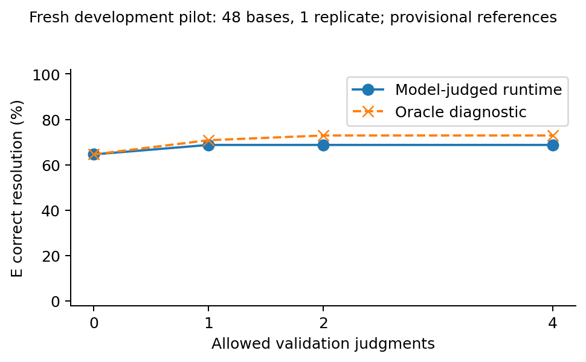

# Fresh Stage 2 GPU execution

**The frozen feasibility pilot ran on the GPU. D and E tied on correctness.** All
48 development base requests completed with one generation replicate: **48 of the
originally targeted 96 pairs**, and **48/48 of the scope selected by the frozen
throughput rule**. The other replicate was removed before any witness judgment or
comparative evaluation. There are no unexpectedly incomplete pairs or exclusions.

At budgets 1/2/4, balanced selection (D) and consequence selection (E) each resolved
**33/48 requests correctly (68.75%)**, versus 31/48 initially. Their witness sequences
differed in **2/48** cases; their final plan IDs differed in one, but correctness
never differed. The separate CPU oracle reached **35/48 for both** at budgets 2/4.
This is evidence that the mechanism runs and can choose differently, **not evidence
of a consequence-selection advantage**. Recommendation: **revise before expansion**,
with one bounded candidate-generation diagnostic; do not launch a larger study yet.

The [historical CPU report](STAGE2_CONTROLLED_PILOT.md) and the exact prior
[blocked-access report](STAGE2_GPU_ACCESS_ATTEMPT_20260912.md) remain preserved. Their
four historical cases and 2/4 result are not included in these fresh estimates.

## Starting point, execution and unchanged protocol

The working tree was clean on `main` at **`a544f31862ff34b359ba25b9439615b5c29abcc3`**,
which is also the execution revision in the saved run manifest. This followed the
CPU delivery `0e31373734c8b2077b6194fc65cf294b1f42cbf3`. The original protocol commit
is `1aa2ad1d5291d21be9ee99150e2baf51e9a62d96`; the historical replay fix is
`df7c5b2a986d798c1b261888e6100b66f6423fe7`. Applicable instructions, implementation,
reports, manifests and both local and pod-side ledgers were inspected. The pod
contained Stage 1 smoke records and no equivalent Stage 2 run or allocation usage.
Its Stage 1 ledger matched the local checksum and the historical 46 generations.

Run identity: **`stage2-pilot-v1`**, created 2026-09-12 18:16:23 UTC. The frozen
configuration, prompts, candidate count, seeds, model, solver, objective, universe,
selectors, judgment mechanism and repair rules were unchanged. No scenario or
reference amendment was needed. The only correctness fix, separately committed as
**`8d34bf0`**, removes a hardcoded “gateway cannot reach pod” statement from the
*offline compact exporter*. It accepts an explicit transfer-verification record and
otherwise reports unverified storage. It changes no inference or evaluation decision
and does not invalidate prior results. New diagnostic/accounting scripts are offline,
committed at **`fc9b90b`**, with their exact file hashes in the analysis source manifest.

The [run manifest](../artifacts/stage2/pilot-v1/run-manifest.json) records configuration
hash `8052d48c26cce2709e6404b34b0789411803d1258492874dd9fd01a006c87c64`,
source hash `a0e4acc5145a0103d3e8d837f39e7a5898ff2ad6923afebedf4df71ba326b7c3`,
and prompt/public/model identities. The frozen protocol's canonical hash remains
`4fafc990fa3d346b741dc2ad5993413036392044ab4869b77492abab2e1df6ca`.

## Connectivity, hardware and integration evidence

The gateway problem was routing after successful authentication, as documented in
the archived access report. The user then supplied a direct TCP SSH connection for
this project's existing pod. That route supported authenticated command execution
and binary shell/stdin transfer. The normal RSA identity worked. The new direct
host key was enrolled on first use, then strict verification was used throughout;
no known-host entry was blindly replaced. The provider environment confirmed the
expected pod ID, and the stored Stage 1 ledger/model paths matched. **The separate
pod used by `OverseeingManyLLMs` was not used.** Endpoint and credential details stay
outside Git. No pod restart, replacement, billing change or unrelated-job change occurred.

The current GPU was an **NVIDIA RTX PRO 6000 Blackwell Server Edition**, 97,887 MiB,
driver 595.91.07, initially idle with no GPU process. Existing persistent `/workspace`
storage and ample free capacity were verified. A new isolated transport clone on
`main` used `PYTHONPATH` without modifying the shared existing environment.

The verified read-only model remained **Qwen/Qwen2.5-7B-Instruct**, revision
`a09a35458c702b33eeacc393d103063234e8bc28`, BF16, no quantization, Transformers
4.51.3, PyTorch 2.8.0+cu128/CUDA 12.8, Python 3.12.3. Translation and judgment used
the same model in fresh invocations. The model file identities were checked before
loading. The existing official model provenance/license record remains applicable.
Translation temperature 0.7, top-p 0.95, seeds beginning at 21000 and maximum 768 new
tokens were unchanged; judgments/critique/repair were greedy. Recorded inherited
settings, including top-k 20 and repetition penalty 1.05, were retained. Greedy-mode
top-p/top-k warnings did not alter sampling or trigger retries.

Model parameters and **every successful generation's output device were `cuda:0`**.
Loading took 4.524 seconds; the GPU process occupied 15,248 MiB immediately after
loading and approximately 18,010 MiB later. All 358 backend generations succeeded;
none hit the output-token cap. The included timing batch was the first four
candidate-only bundles, 16 translations, not an additional uncharged warm-up.
Structured translations, witness rendering, judgments, bounded baseline repairs,
checkpoint writes and replay all exercised the actual pipeline.

The model was disposed in `finally`; the immediate probe retained a 706 MiB CUDA
context. A subsequent probe confirmed **no GPU processes**, and the inference PID
was absent. The first empty-process probe preceded archive creation at 18:29:10 UTC,
about six seconds after ledger closure. The conservative 30-second teardown allowance
is retained. See [GPU evidence](../artifacts/stage2/pilot-v1/gpu-evidence-1789237054700006824.json)
and [connection/shutdown verification](../artifacts/stage2/pilot-v1/connectivity-and-shutdown.json).

## Data, annotation checks and throughput decision

These are **constructed, assistant-authored requests over published TriMet schedules**,
not passenger requests or observed vehicle movements. All annotations remain
**provisional, automatically checked, not human audited**. The unchanged
[human review export](../data/pilot/annotation-review.csv) is available for later review.

The frozen ZIP checksum is
`82e6b822de008367b3d3d35bb52545807ea41b6f56623a9aa4b1162b3d54671b`.
The common universe uses routes 2/4/17, all buses, 70 stops and 6,574 ride edges,
2026-09-14 07:00–10:00 in America/Los_Angeles. Pools have at most 64 journeys per
single segment and 256 combined journeys. The 48 pools contain 4,366 journey
memberships; 40 pools are truncated and eight complete under the supported bounds.
There are at most two rides per segment, exact-stop connections with a 120-second
minimum, no invented walking or through-service. Mode exclusions are exercised
linguistically, but this bus-only subset cannot establish multimodal transport validity.
See [data provenance and reuse limits](../docs/data.md).

Before GPU evaluation, the separate wording/reference consistency process matched
**48/48 requests** and checked **4,366/4,366 journey memberships**. Configuration,
prompts, data, references and scenario ordering matched frozen hashes. There were
no identified discrepancies, amendments, dropped cases or injected candidate errors.
The [preflight record](../artifacts/stage2/execution-attempt-20260912/preflight.json)
predates the run. Automated agreement is not independent human validation.

Coverage was fixed before model outcomes: eight requests each for timing, transfers,
mode exclusion, outbound/return scope, ordered visits and infeasibility; 40 are
reference-feasible and eight infeasible within their pools. Each is a distinct new
base/OD scenario; routes, entities and service date still overlap. No publication
holdout was used.

The frozen timing rule used the first 16 translation latencies: p95 **3.8442 s**, then
reserved 1.5×, **5.7662 s/call**, plus its prescribed overhead. Two replicates forecast
about **8,339 seconds**, exceeding the available allocation. One replicate forecast
**4,644.47 seconds**, with an upper bound of 768 calls. The runner wrote
[scope.json](../artifacts/stage2/pilot-v1/scope.json) before judging and retained all
48 bases in the predeclared order. Actual runtime was much shorter, but we did not
restore the second replicate after observing results. This is application of the
frozen resource rule, not an outcome-selected sample or methodological amendment.

## Paired comparison and independent outcomes

D/E shared the same four raw translations per pair, exact and finite-domain semantic
deduplication, earliest-arrival/boardings/departure/ID objective, complete evaluation
of the same pool, witness costs of one, judgment prompt/cache, stopping rules and
elimination-only update. They had **zero repair allowance**. Candidate formulas,
votes, reference labels and selector preference were absent from ordinary judge
inputs. All 58 logically attributed D/E judge calls were matched to the deterministic
public-only prompt. The offline reference evaluator never guided ordinary selection.

The existing runner reused prefixes for budgets 0/1/2/4. Every D/E pair used identical
candidate bundles; every saved witness and score was independently recomputed by the
offline audit. All 48 paired decisions, including secondary baselines, replayed exactly
from the saved outputs under the recorded source revision. Timeouts and missing
outputs are separate from infeasibility; none occurred in D/E here.

| Allowed judgments | D correct | E correct | E wins / ties / losses | Paired E−D | Model D/E correct-rate 95% bootstrap interval |
|---:|---:|---:|---:|---:|---:|
| 0 | 31/48 (64.58%) | 31/48 (64.58%) | 0 / 48 / 0 | 0 pp | 50.00–77.08% |
| 1 | 33/48 (68.75%) | 33/48 (68.75%) | 0 / 48 / 0 | 0 pp | 56.25–81.25% |
| 2 | 33/48 (68.75%) | 33/48 (68.75%) | 0 / 48 / 0 | 0 pp | 56.25–81.25% |
| 4 | 33/48 (68.75%) | 33/48 (68.75%) | 0 / 48 / 0 | 0 pp | 56.25–81.25% |

Intervals use the existing 10,000-draw percentile bootstrap, seed 2201, resampling
base requests and keeping any replicates together. Here each base has one replicate.
The empirical paired-difference interval is [0, 0] because every observed pair ties;
it is **not a population equivalence bound or evidence of zero uncertainty**. This
exploratory, correlated-route sample supports no significance claim.

| Budget (both D and E) | Valid plans / 40 feasible requests | Invalid plans | False infeasibility | Correct infeasibility / 8 | Unresolved | Invalid interpretation output | Timeout / infrastructure failure |
|---:|---:|---:|---:|---:|---:|---:|---:|
| 0 | 28 | 5 | 7 | 3 | 0 | 5 | 0 / 0 |
| 1 | 30 | 5 | 5 | 3 | 0 | 5 | 0 / 0 |
| 2 | 30 | 5 | 5 | 3 | 0 | 5 | 0 / 0 |
| 4 | 30 | 5 | 5 | 3 | 0 | 5 | 0 / 0 |

All five invalid-output bundles are infeasible requests for which every translation
reported an unsupported interpretation. They are not correct infeasibility conclusions.
Output coverage, defined as a plan or a finite-pool infeasibility report, is 43/48;
25/48 cases receive model validation evidence, while 18 validly parsed bundles have
no distinguishing witness. A model-resolved semantic status is not proof of correctness.
At budget 4, valid returned plans are 30/35, but the primary feasible-request denominator
remains 40. Validation improves three initial results and damages one for each method;
D/E perform no model repair. Budgets 2 and 4 add no final correctness beyond budget 1.

| Request family (8 each) | Initial correct | Model-judged D = E | Oracle D = E, budget 4 | Bundles with distinguishing alternatives |
|---|---:|---:|---:|---:|
| Timing | 8 | 8 | 8 | 7 |
| Transfers | 7 | 7 | 8 | 3 |
| Mode exclusion | 5 | 5 | 5 | 7 |
| Outbound/return scope | 3 | 3 | 4 | 3 |
| Ordered visits | 5 | 7 | 7 | 5 |
| Infeasible | 3 | 3 | 3 | 0 |

These family counts are descriptive, not independent subgroup experiments. The two
D/E-divergent cases are both correct under both methods at every budget. That conditional
2/2 tie is secondary; it does not replace the full 48-base result.

## Missing alternatives and selector degeneracy

[Per-bundle diagnostics](../artifacts/stage2/pilot-v1/bundle-diagnostics.json) retain
requested/parsed counts, duplicates, acceptance signatures, candidate plan statuses,
cross-violations, witness counts, weights, reference coverage and all final outcomes.

| Measurement | Fresh observation |
|---|---:|
| Requested / returned / parsed translations | 192 / 192 / 160 |
| Repeated identical text within bundles | 8 |
| Parsed canonical-formula duplicates | 43 |
| Canonical formulas after deduplication | 117 |
| Additional syntax variants collapsed by pool equivalence | 40 |
| Semantic candidate classes across all bundles | 77 |
| Bundles with 0 / 1 / 2 / 3 / 4 classes | 5 / 18 / 18 / 5 / 2 |
| At least two classes / available witnesses | 25/48 (52.08%) |
| At least one consequential candidate-plan disagreement | 18/48 (37.50%) |
| Incorrect initial result with a correct candidate-selected plan available | 5/48 |
| Reference-equivalent interpretation present | 23/48 (47.92%) |
| Correct candidate-selected plan despite no equivalent interpretation | 13/48 |
| Correct final ordinary plan despite no equivalent interpretation | 12/48 |
| Variable consequence weights / different initial witness rankings | 4/48 / 4/48 |
| Different first witness / different witness sequence | 2/48 / 2/48 |
| Different final status or plan ID / different final correctness | 1/48 / 0/48 |

The 32 interpretation failures comprise 20 unsupported reports, seven entity-resolution
failures and five malformed interpretations. These are natural model outputs, not
injected errors or failed GPU calls. Eight bundles repeatedly produce only one canonical
formula among their valid outputs. Twenty-six have some distinct syntax with equal
acceptance patterns in the pool; ten of the 18 single-class bundles lose their only
syntactic diversity this way. Seven witness-bearing bundles have no selected-plan
consequence despite semantic differences. In 23 of 25 witness-bearing bundles the
ordinary witness sequence is identical for D/E.

There are 1,237 distinguishing journey memberships across bundles, ranging from one
to 256 in witness-bearing pools. Twenty-one of the 25 such bundles have uniform pair
weights, making E's score a positive scalar multiple of D's score. In particular,
with two candidate classes there is only one pair, so the rankings necessarily agree
at unit cost. E has a mathematical opportunity here mainly with three or four classes
and nonuniform pair consequences; that occurs in four bundles. This is a **structural
property plus a limited opportunity distribution**, not a coding error forcing equality.
Twenty-three bundles have a top-score tie under each policy; stable journey-ID
ordering resolves it. No tie rule or weight was changed after observing outcomes.

Pool equivalence does not establish natural-language correctness or equivalence outside
the checked pool. Some differences are invisible because bounds are vacuous in the
public horizon, the subset is bus-only, or there are gaps between scheduled departures.
We did not enlarge pools after seeing outcomes. The artifacts distinguish equal pool
vectors from repeated formulas; they cannot establish which missing outside-pool
journeys would discriminate the interpretations. No claim of global completeness follows.

### Worked calculation: actual `pilot-00-r0`

The request requires departure at/after 08:25:17 and arrival by 09:30:25. All candidates
mistranslate numerical bounds. After deduplication, c0 and c2 select the same valid
plan, while c1 is infeasible in the pool. Their consequence scores are
I(c0,c1)=1, I(c0,c2)=0, I(c1,c2)=1; the E weights are **2, 1, 2**. Missing-plan terms
contribute zero under the frozen rule, without implying correct natural-language infeasibility.

| Witness ID | Acceptance (c0,c1,c2) | D separation score | E weighted score |
|---|---|---:|---:|
| `002ee67351572c9abe93` | (true,false,false) | 1+1 = 2 | 2+1 = 3 |
| `00b30b64cd73de674651` | (true,false,true) | 1+1 = 2 | 2+2 = 4 |

Both costs are one. D ties all 16 witnesses and selects the first ID; E ties seven
witnesses at score four and selects the second ID shown. Both judgments are correctly
“satisfied.” D reaches c0 in one query; E keeps c0/c2 and needs a second query to reach
c0. Both retain the same valid final plan throughout, even though no interpretation
is reference-equivalent. This is a real selection difference with **no outcome gain
and one locally unnecessary E query**.

## Oracle diagnostic and representative causal traces

Oracle replay uses only saved candidate bundles and the independent CPU reference
checker, with identical selection/update rules and **zero GPU repair or generation
calls**. Privileged labels appear only in its separate output tree.

| Judgment budget | Oracle D correct | Oracle E correct | E wins / ties / losses | Valid plans / 40 | Invalid plans | False infeasibility | Correct infeasibility / 8 |
|---:|---:|---:|---:|---:|---:|---:|---:|
| 0 | 31 | 31 | 0 / 48 / 0 | 28 | 5 | 7 | 3 |
| 1 | 34 | 34 | 0 / 48 / 0 | 31 | 3 | 6 | 3 |
| 2 | 35 | 35 | 0 / 48 / 0 | 32 | 2 | 6 | 3 |
| 4 | 35 | 35 | 0 / 48 / 0 | 32 | 2 | 6 | 3 |

All oracle rows retain five invalid interpretations, zero unresolved outputs and no
solver/infrastructure failures. At budget 4 the correct-rate interval is
60.42–85.42%; all 13 remaining failures lack a reference-equivalent candidate.
The oracle improves five initial results and damages one. Correct witness labels
therefore help both methods equally, but do not fix missing candidate coverage.
E uses 30 oracle judgments at budget 4 versus D's 28, without a correctness gain.

Among **31 distinct ordinary D/E judgment invocations**, seven labels are wrong
(24/31 agree with reference), none are uncertain. Logical D/E counts are 6/29 wrong
for D and 7/29 for E; shared calls are not independent observations. Five logical
elimination events remove a reference-equivalent candidate. Every supplied span is
in bounds, but 26 unique calls cite “On 20,” matching the example offsets in the
prompt; this is consistent with copying the example, not meaningful source support.
Some correct verdicts also have incorrect explanations. Source pointers are not proof.

The [saved diagnostic traces](../artifacts/stage2/pilot-v1/diagnostic-traces.json) use
the first lexicographic case for useful validation, harmful validation, divergence,
wrong-without-alternatives and correct-plan-without-equivalence, plus **all** divergent
cases and **all** ordinary/oracle correctness differences. This keeps failures and
ties visible. Timetables/full prompts remain in authorized raw storage; committed
traces retain requests, formulas, plans, witness IDs, scores, judgments and updates.

- **Useful validation, `pilot-12`:** ordered intermediate calls and buses are requested.
  c0 invents a departure bound of 114,000 seconds and reports infeasibility; c1's
  weaker extra bound leaves a valid selected plan. A concrete journey visits the
  required stops in order; the judge correctly says satisfied. Both policies discard
  c0, retain c1 and fix the false infeasibility in one query.
- **Harmful validation, `pilot-14`:** the request says depart *no later than* 07:28:14.
  Every candidate instead uses a lower bound, one far beyond the horizon. The first
  candidate happens to select a valid plan. A later distinguishing journey truly
  violates the deadline; the correct “violated” label removes both satisfiable
  interpretations, leaving the infeasible one. Both methods, including the oracle,
  damage a correct initial output. The model additionally invents a transfer violation
  in its reason; the label itself is correct. This failure is candidate coverage/update
  behavior, not a wrong oracle label or a repair implementation error.
- **No useful alternative, `pilot-02`:** wrong intermediate-stop lists make all four
  formulas reject every pool journey, collapsing to one infeasible class. No witness
  exists, so neither ordinary nor oracle validation can repair the false report.
- **Divergence without correctness benefit, `pilot-00`:** the worked calculation above
  shows a correct plan despite wrong formulas, and an extra E query without improvement.
- **Divergence with judge error, `pilot-37`:** E's different first witness is falsely
  rejected for departing *earlier* than a latest-departure bound and for an invented
  second transfer. It eliminates a reference-equivalent candidate and chooses a
  different plan. That plan still satisfies the request; D and E remain tied on the
  primary outcome. The oracle uses more E queries but gains no correctness advantage.
- **Oracle-only recoveries, `pilot-34` and `pilot-40`:** in the former, the second model
  judgment accepts a journey departing before the stated bound and eliminates the
  useful alternative. In the latter, the judge claims that 09:42 is earlier than 09:12,
  wrongly rejects a return journey and preserves false infeasibility. Correct oracle
  labels recover both cases under both selectors.

## Baselines, inference cost and GPU accounting

The frozen secondary methods completed as provided: A (single translation + solver),
B (one ordinary critique/repair), C (two concrete positive/negative example judgments,
SSV adaptation, with at most one repair). Their adaptations and limits are unchanged.
No baseline was selected using evaluation labels.

| Method, maximum configured validation | Correct / 48 | Calls logically attributed | Input / output tokens | Attributed generation latency (s) | Repairs improving / damaging correctness |
|---|---:|---:|---:|---:|---:|
| A | 31 | 48 | 109,214 / 7,213 | 104.96 | 0 / 0 |
| B | 32 | 96 | 226,889 / 14,584 | 210.33 | 1 / 0 |
| C | 19 | 137 | 224,079 / 15,479 | 219.95 | 1 / 13 |
| D, budget 4 | 33 | 221 | 455,381 / 30,421 | 439.02 | 0 / 0 |
| E, budget 4 | 33 | 221 | 455,380 / 30,399 | 438.74 | 0 / 0 |

C returns 19 correct resolutions, two invalid plans, six invalid interpretations and
21 unresolved outputs. B returns 32 correct, four invalid plans, six false infeasibility
reports, five invalid interpretations and one unresolved output. C's negative finding
is retained; its unresolved outputs are never counted as infeasibility. D/E improvements
are from elimination, not repair. Their initial four-candidate cost is much larger
than A's single translation even when they select the same initial result.

| Budget | D / E logical judgments | D / E logical calls | D input / output tokens | E input / output tokens | D / E generation latency (s) |
|---:|---:|---:|---:|---:|---:|
| 0 | 0 / 0 | 192 / 192 | 436,856 / 28,407 | 436,856 / 28,407 | 412.61 / 412.61 |
| 1 | 25 / 25 | 217 / 217 | 452,919 / 30,128 | 452,919 / 30,105 | 435.19 / 434.88 |
| 2 | 29 / 29 | 221 / 221 | 455,381 / 30,421 | 455,380 / 30,399 | 439.02 / 438.74 |
| 4 | 29 / 29 | 221 / 221 | 455,381 / 30,421 | 455,380 / 30,399 | 439.02 / 438.74 |

Saved candidate solver time is 0.726 seconds per logically attributed D/E method.
Latency is the sum of recorded call times, attributed as if each method incurred them
independently; it is not a separately measured end-to-end wall time for each cached
method. Prefix rows must not be summed as separate experiments. Oracle rows retain
candidate-generation logical cost plus their explicit privileged-query counts; their
labels consume no model tokens. Paired selection yields no E benefit to trade against
cost; E has 23 fewer generated/prompt tokens at maximum budget, an incidental difference.

Actual hardware work is separate from those logical tables:

| Stage 2 actual purpose | Attempted generations | Input tokens | Output tokens | Generation latency (s) |
|---|---:|---:|---:|---:|
| Translation, shared bundles | 192 | 436,856 | 28,407 | 412.61 |
| Judgment, all methods after cache reuse | 96 | 60,920 | 6,446 | 84.56 |
| Ordinary critique | 48 | 117,675 | 7,371 | 105.37 |
| Concrete-feedback repair | 22 | 72,316 | 3,867 | 57.24 |
| **Total** | **358** | **687,767** | **46,091** | **659.78** |

There were zero failed backend generations, retries, truncations or additional oracle
GPU calls. **Stage 2 model-resident time was 681.6209 seconds (11.36 minutes,
0.1893 GPU-hours)**, including loading, inference, waits and disposal. Its 30-second
allowance gives at most **711.6209 seconds**, well below the existing 7,200-second
ceiling; 358 attempts are below 1,500. The ledger's 7,170-second guard and outer
7,180-second timeout remained active. CPU model-file hashing before GPU loading,
SSH checks, transfer and offline replay are not model-resident GPU work.

Historical usage remains 46 generations and 237.3902 seconds, plus ≤30 seconds.
**Cumulative: 404 generations, 919.0111 measured GPU seconds, plus ≤60 seconds total
uncertainty (≤979.0111 seconds conservatively).** No allocation was reset or renewed.
The downloaded Stage 2 journal extended the original local allocation only after
its exact prefix matched. See [reconstructed accounting](../artifacts/stage2/pilot-v1/gpu-accounting.json).

## Artifacts, verification and reproduction

The full fresh run is retained locally under `runs/stage2-pilot-v1` and remotely on
the already authorized persistent `/workspace` volume. Compact aggregate results,
trace pointers, manifests, diagnostics and four figure types are in Git. Raw schedules,
full prompts, weights and caches are not. Remote storage is verified replication on
the existing volume, not a claim of an independent off-provider backup or perpetual
availability. Reuse remains governed by the recorded TriMet terms.

| Preserved archive on `/workspace/LLMplanningConstraintsStage2/` | SHA-256 | Bytes |
|---|---|---:|
| `stage2-pilot-v1-results.tar.gz` | `1f8b63fb3e863ec9564910bfdaf8e7304b878089cb2ff7da54d964a966383871` | 954,381 |
| `preservation/stage2-retained-artifacts-20260912.tar.gz` | `f5cfac0529e88e971b1a384bf3383ed6113b43d2de25f0592c59f3459e2fc62a` | 693,342 |
| `preservation/stage2-offline-analysis-v1.tar.gz` | `2359a710ce51874d1a1510bd328a72b953011d5ea901327fbcf8dd033d1dbb66` | 1,489,498 |

The first contains 156 files, including the raw run, ledger and launch diagnostics;
152 run JSON/JSONL file identities are in the compact manifest. The second durably
replicates the previously local-only 154-file archive, including prior unsuccessful
and corrected CPU records. Both remote/local archive checksums matched. Offline
analysis, oracle outputs and the 48-pair replay are separately preserved with their
own checksums in [offline replication](../artifacts/stage2/pilot-v1/offline-replication.json).

All **32 tests passed** and Ruff passed. Exact saved-source replay matched **48/48
pairs** without GPU generation; the supplementary audit recomputed every D/E witness
and checked every ordinary judge prompt. The frozen pre-evaluation checks remain
valid and no package source changed. The separate exporter metadata fix and new
offline scripts were exercised on these actual artifacts. The historical failed
access report and earlier plots/results were preserved under their original identities.

The existing four plots were regenerated from actual fresh summaries, without
hypothetical improvements: [correct resolution](../artifacts/stage2/pilot-figures/correct-resolution.pdf),
[paired outcomes](../artifacts/stage2/pilot-figures/paired-outcomes.pdf),
[selector variation](../artifacts/stage2/pilot-figures/selector-degeneracy.pdf), and
[model versus oracle](../artifacts/stage2/pilot-figures/model-versus-oracle.pdf).
Each also has SVG and PNG versions. Their labels state development provenance and
provisional references. Historical plots remain separate.



From the repository root, after restoring the retained raw archive (or using the
existing local run), reproduce without the GPU:

```bash
uv sync --frozen --extra dev --extra analysis
uv run --frozen python scripts/replay_revision.py --run runs/stage2-pilot-v1 \
  --output runs/stage2-pilot-replay-v1
uv run --frozen plancheck pilot-analyze --run runs/stage2-pilot-v1 \
  --public data/prepared/stage2/public --references data/pilot/references.json \
  --output runs/stage2-pilot-analysis-v1
uv run --frozen python scripts/stage2_fresh_diagnostics.py \
  --run runs/stage2-pilot-v1 --analysis runs/stage2-pilot-analysis-v1 \
  --public data/prepared/stage2/public --references data/pilot/references.json \
  --output runs/stage2-pilot-diagnostics-v1
uv run --frozen python scripts/stage2_execution_accounting.py \
  --run runs/stage2-pilot-v1 --ledger runs/stage2-gpu-budget.jsonl \
  --previous artifacts/stage2/gpu-accounting.json \
  --output artifacts/stage2/pilot-v1/gpu-accounting.json
uv run --frozen --extra analysis plancheck pilot-figures \
  --analysis artifacts/stage2/pilot-v1 --output /tmp/stage2-pilot-figures \
  --label 'Fresh development pilot: 48 bases, 1 replicate; provisional references'
```

The last plotting command works from compact committed results alone. Full analysis
and replay need retained schedules/model outputs, but no GPU or weight download.
The [run guide](../docs/stage2-running.md) includes checksum-verified restoration,
export and the exact historical launch command. Existing immutable outputs are reused;
a changed analysis definition requires a new identity. No further GPU launch is needed
to complete this stage.

## Recommendation and evidential limits

| Claim | Assessment from this pilot |
|---|---|
| A. The pipeline operates | Yes: actual CUDA inference, guarded completion, independent checks and exact replay |
| B. Candidates contain useful alternatives | Sometimes: 25 distinguishable bundles, 18 consequential bundles, five opportunities to fix a wrong initial result with a selected candidate plan |
| C. Selectors choose differently | Yes, 2/48; uniform weights and two-class bundles sharply limit opportunity |
| D. E improves final outcomes | No observed improvement: 0 wins, 48 ties, 0 losses at every budget, including the oracle |
| E. An advantage justifies inference cost | Not established; oracle E uses two more judgments overall without a gain |

**Revise before expansion.** A full publication-scale selector study is not justified
by two outcome-neutral divergences. Candidate coverage and time conversion errors
limit both policies; judge unreliability removes two otherwise recoverable outcomes.
The finite bus-only pools also hide semantic differences. Neither the positive effect
of extra validation over the initial output nor a synthetic selector fixture establishes
the proposed practical contribution. The fresh tie does not prove impossibility.

One concrete later experiment: compare the existing seconds-valued translation
interface against **HH:MM:SS-valued time atoms compiled deterministically to seconds**,
with the same four-candidate count, model and seeds on these development requests.
Freeze the amendment and annotation review first; use reference-equivalent candidate
coverage and parsed-output coverage as the main diagnostics, then CPU oracle replay.
Do not add a suite of candidate-generation alternatives or optimize selection weights.
This targets the observed arithmetic failures without supplying intended constraint
semantics or evaluation labels to inference. It may reduce spurious diversity; that
is acceptable if coverage improves. Judge redesign would remain a separate decision.

The saved old arm can be reused with its logical cost charged. The new arm needs
192 translations: at the measured **2.149 seconds/translation**, about **6.9 minutes**
of generation, with a conservative **25-minute single-GPU envelope** based on the
observed translation p95 and loading/overhead. Rerunning both arms would require
384 calls and roughly twice that envelope. This is an estimate for a separately
authorized, frozen experiment, not a new allocation or a launched stage.

Remaining limits are one model, one replicate, assistant-authored unaudited wording,
shared route/date coverage, conditional pool completeness, vacuous mode constraints,
weak source-span evidence, and only two selector-divergent cases. Human review of the
existing export is the next non-GPU action. The completed Stage 2 pilot itself needs
no further access intervention.
